# Use the MicroStrategy REST API and Postman to Get Report Results

MicroStrategy's REST API gives developers the ability to execute MicroStrategy reports and return their data. This example will find a report, run it, and return its data using MicroStrategy's REST API in Postman. This article will give you steps to begin using MicroStrategy's REST API in your own workspace within Postman and show you how to run a workflow that returns the results of a specific report. This is valuable for when you want to take advantage of MicroStrategy's reporting and integrate with your organization's API ecosystem. The example in this article will give you the framework to build your own workflows and help you take advantage of MicroStrategy's powerful REST API and Postman's easy to use interface - a perfect combination for those who want to use MicroStrategy's REST API but are unsure how to get started.

## The Pieces We'll Use

- Postman
- REST API hosted on MicroStrategy Library

## High Level Steps

1. Create your own Fork of the MicroStrategy REST API Workflow collection and Environment template in Postman.
1. Create a Folder for running a report in your workspace in Postman.
1. Copy over example code from the examples provided.
1. Customize the code to work with your report in your environment.

## Steps

1. Find MicroStrategy's public API in Postman and make your own copy (Fork).

   Login to Postman and search for MicroStrategy in the homepage search bar. Select "MicroStrategy SDK".

   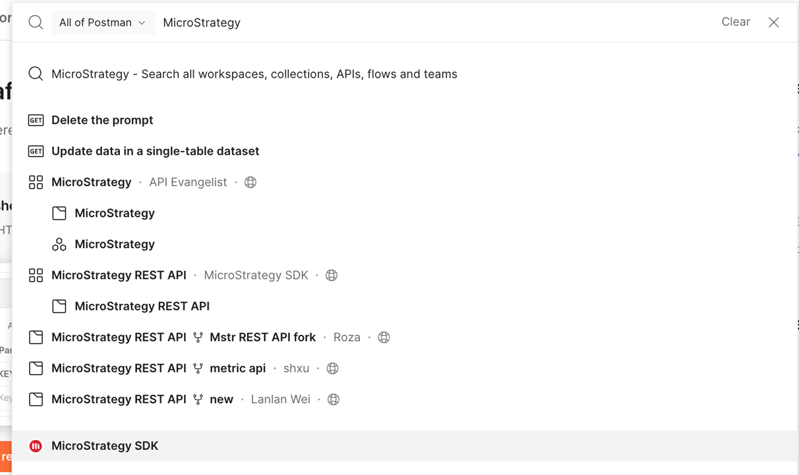

1. Once at MicroStrategy's Collections page, select "MicroStrategy REST API Workflows".

   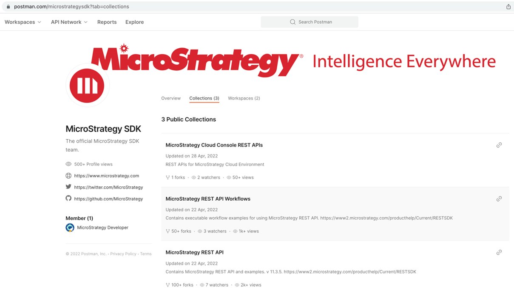

1. Under **Collections**, click on the the `…` next to MicroStrategy REST API Workflows and select "Create a fork".

   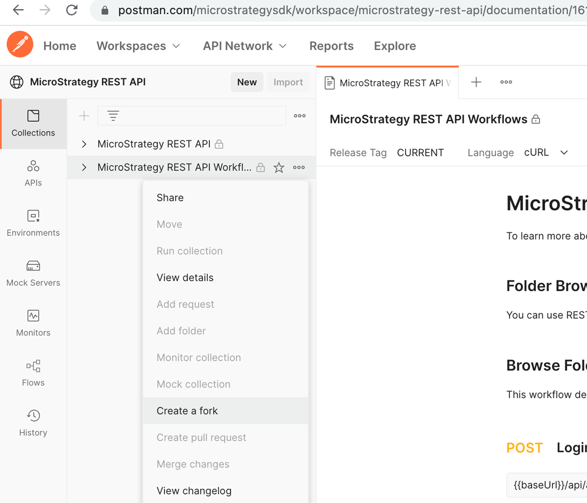

1. Name the Fork something memorable and save it to "My Workspace" (this requires you to be signed into Postman with a Postman account). Don't forget to check "Watch original collection" for updates to the code! Once you click "Fork Collection" you will create your own copy of this code collection into your workspace. You can change your copy as you see fit. In this case, we will add a folder and some calls!

   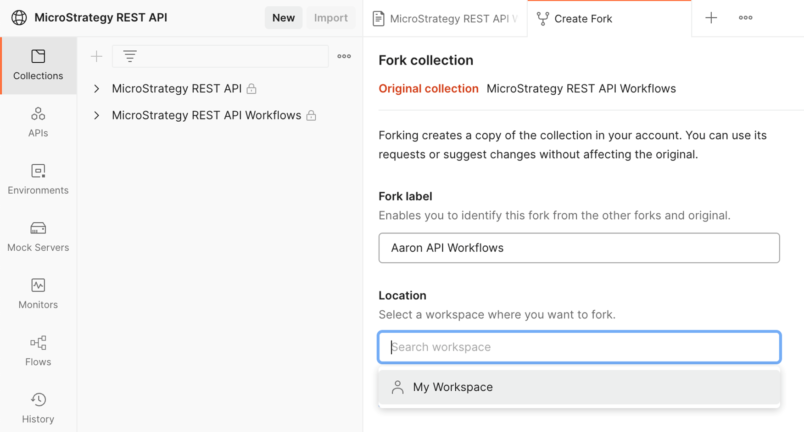

1. We're not done yet with MicroStrategy's public page. Let's go to **Environments** and fork "envxxxxxx – Template for Environment" to our workspace as well.

   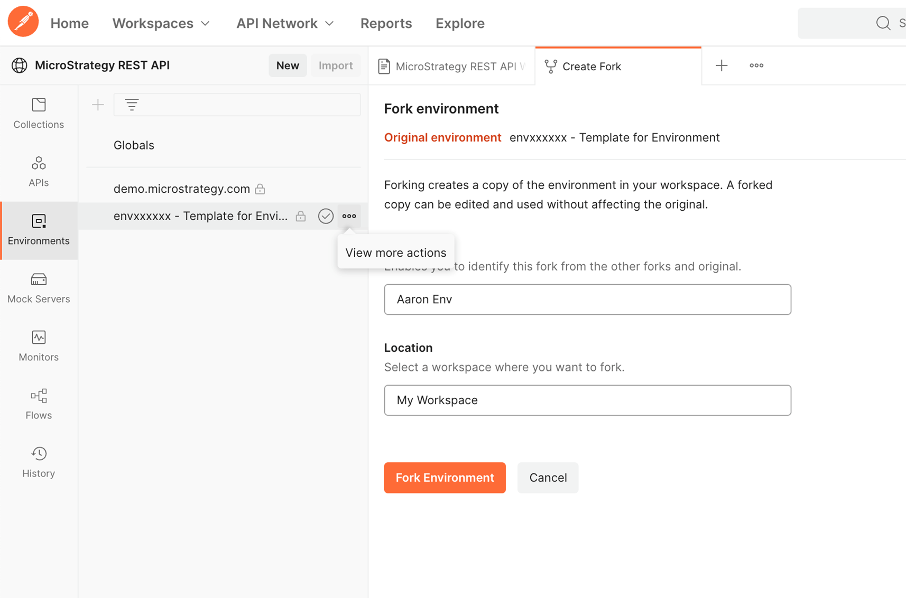

1. Once you fork the environment, you will be taken to your environment in your workspace. Take a moment to fill in the variables displayed with your own values. Also, feel free to rename your environment!

   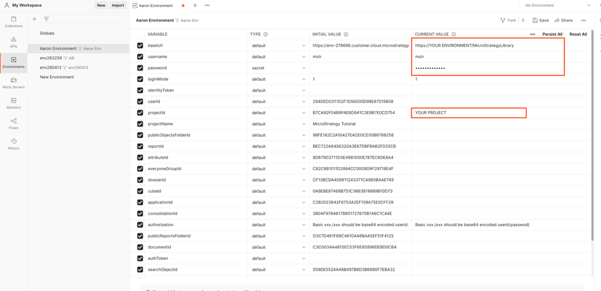

1. Okay, now that we've customized our environment, let's create folder under **Collections** à MicroStrategy REST API Workflows in My Workspace. Do this by selecting "Add Folder" after clicking on the three dots by your copy of the MicroStrategy REST API Workflows. Rename the folder to **Get Report Results**.

   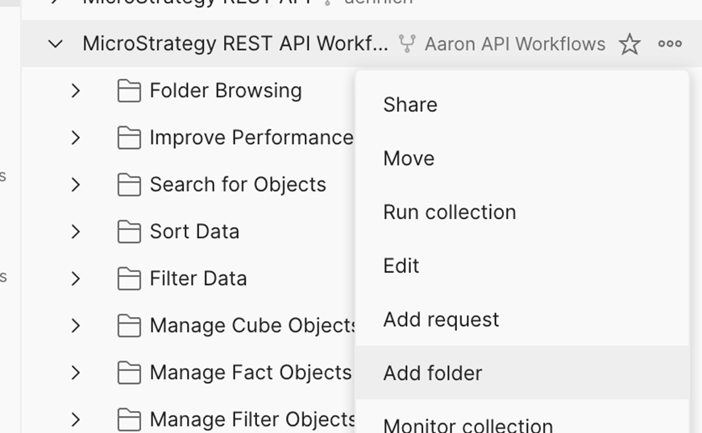

1. Here's where the things get interesting - We could write new calls to populate our folder using any part of MicroStrategy's REST API.  HOWEVER, the workflow we are seeking already exists as an example in this collection! So, let's just duplicate the calls in this folder and drag into our "Get Report Results" folder.

1. Find "Create a Report Instance and Get Definition" under "Data API" -> "Report" and duplicate the folder.

   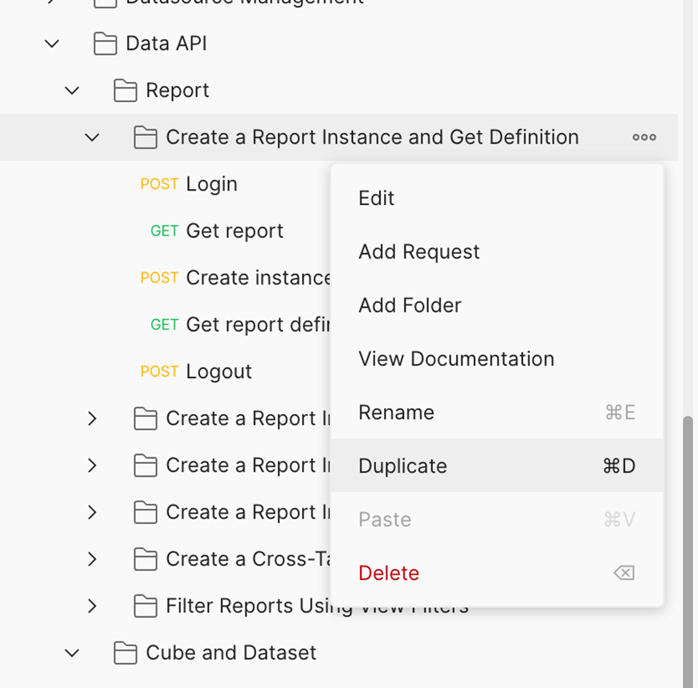

1. Pull the folder into your "Get Report Results" folder. You can rename as you see fit, or even pull each call out into the Get Report Results folder – it's up to you.

   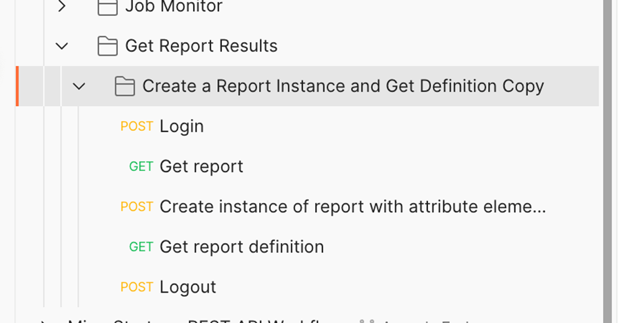

1. This workflow has 5 calls: Login, Get Report, Create Instance of Report, Get Report Definition, Logout. Running these calls in this order will Log you into your environment, find your specified report, "run" and instantiate the report, return the definition of the report (including its data) and log you out of your environment. Let's change the "Get Report" call to call a specific report in our environment. For this example, I'm going to get a report I created called "Locations and Sales by Month". For the rest of this example, use your desired report instead of "Locations and Sales by Month".

1. Click on the "Get Report" call under your "Get Report Results" folder. You will see the call's Parameters. Here, we want to change the value of the "name" parameter from "Forecast (Grid)" to your report name. For me, this will be "Locations and Sales by Month". Type=3 means "Report" as you can see in [EnumDSSXMLObjectTypes](https://www2.microstrategy.com/producthelp/Current/ReferenceFiles/reference/com/microstrategy/webapi/EnumDSSXMLObjectTypes.html). Don't forget to **Save** your changes!

   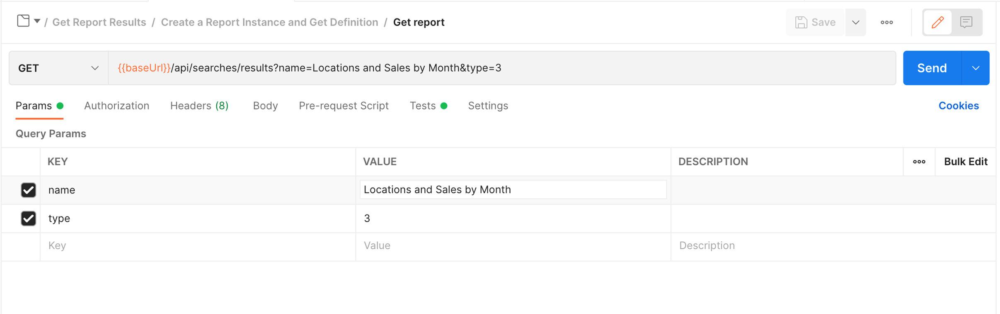

1. **NOTE:** Take a look at the **Headers**. This is where we will pass some environment variables with our call. You will see `X-MSTR-AuthToken` and `X-MSTR-ProjectID`. These tell your MicroStrategy server that your logged in and which project to search when we search for a Grid Report (Type 3) named with the value we used for the "name" Parameter. No changes to be made here, just good stuff to understand.

   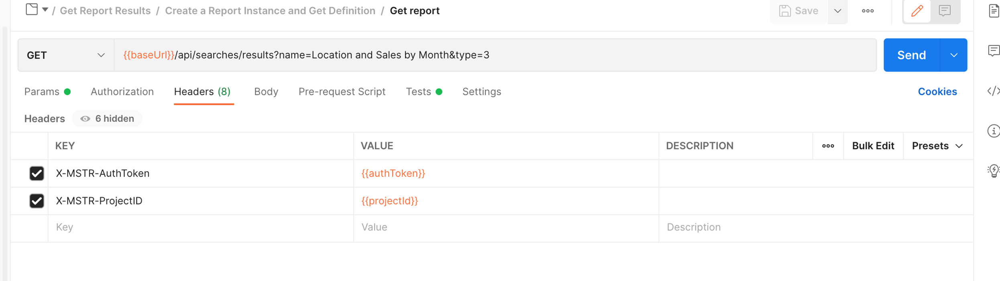

1. Let's check our running of the report in our POST call to Create an Instance of the Report. Here we see that we will pull in the value of the report from the previous call and pass it through the `{{rd_reportId}}` variable. No changes here either!

   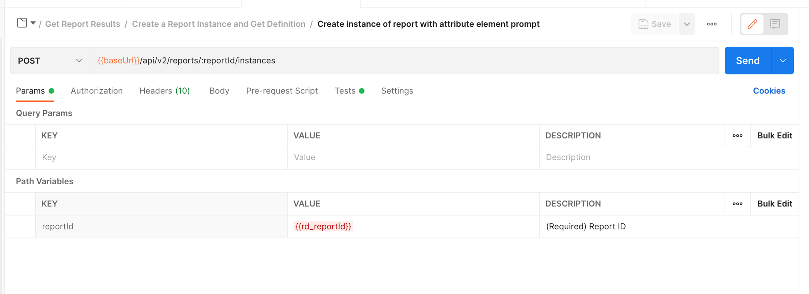

1. Finally, let's check our "Get Report Definition" GET call. Here we see the 2 key parameters, `{{rd_reportID}}` and `{{rd_reportInstanceId}}`. This tells your MicroStrategy server to get the results of the report with the specified ID and fetch the "run" of that report with the specified report instance id (the one we created with the POST call in the previous step). No changes to be made here either!

   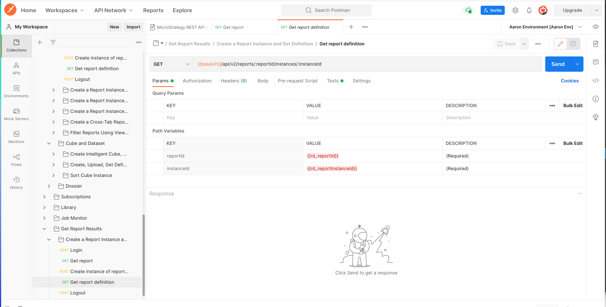

1. Now, we're ready to run the whole workflow! Click on the folder holding the calls. This will take you to a page that shows the calls in the folder and gives you an option to run the whole folder. We will click on "Run".

   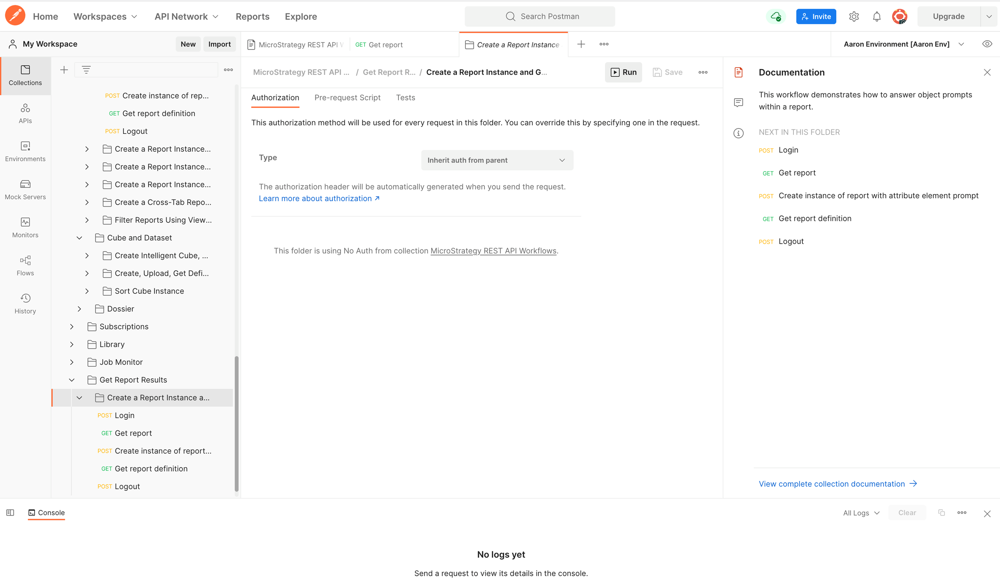

1. **IMPORTANT:** Make sure you select your environment in the top right-hand corner. This will give your environment variables the definitions that we defined in step 6. Also, make sure you open your console so you can see the results.

   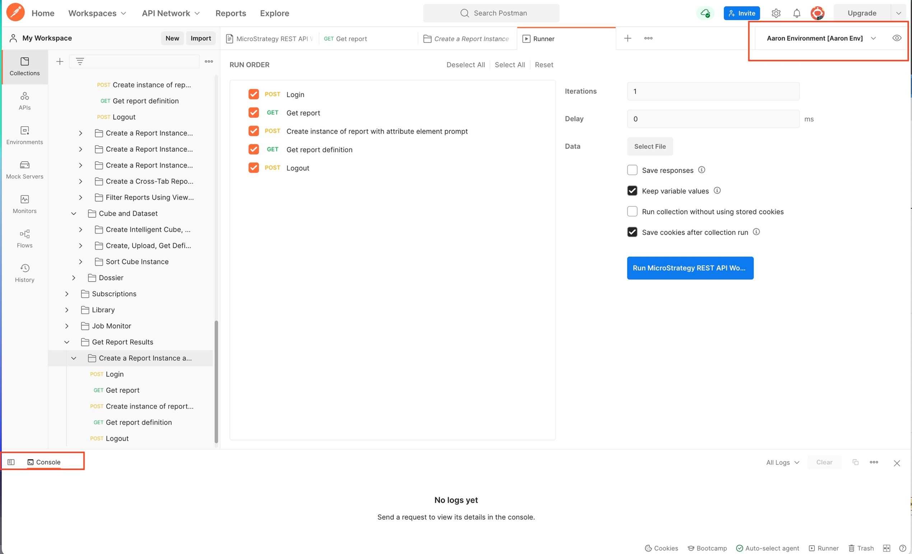

1. Now we're ready – run the workflow!

1. A successful run looks like this:

   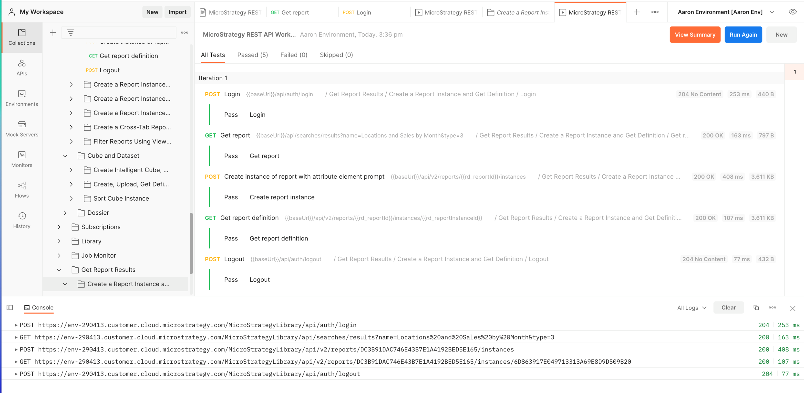

1. Now look in the results of the 2nd GET call – you should see your report data in the response body of the call:

   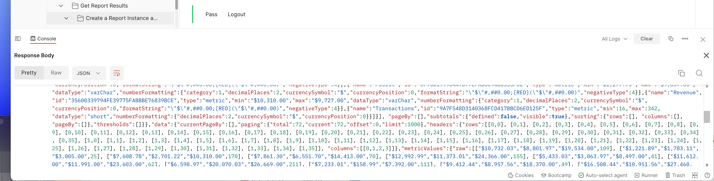

   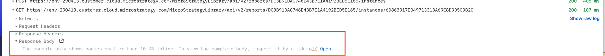

For Reference, here is the report ran in MicroStrategy Web:

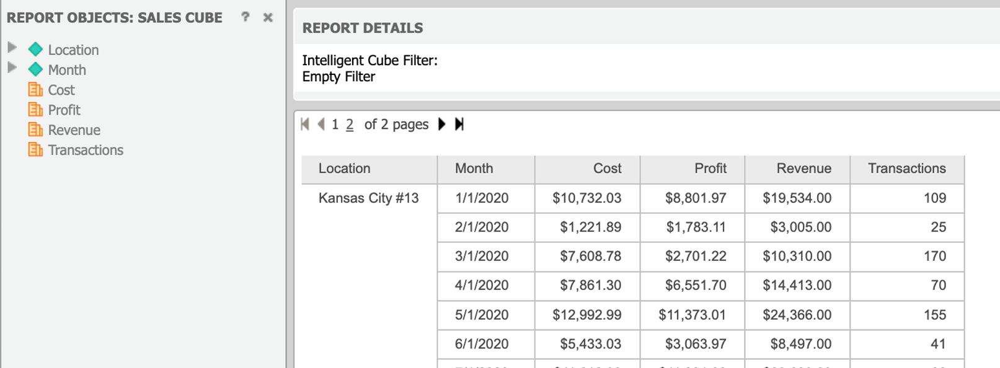

- **Author:** Aaron Ehrlich (Senior Sales Engineer, MicroStrategy)
- Original source: [KB485553: Use the MicroStrategy REST API and Postman to Get Report Results](https://community.microstrategy.com/s/article/Use-the-MicroStrategy-REST-API-and-Postman-to-Get-Report-Results?language=en_US)
